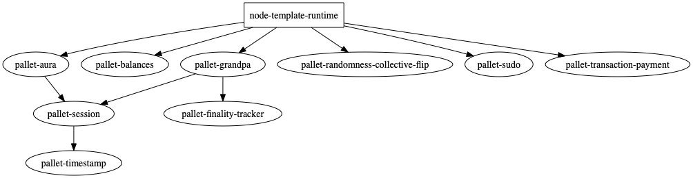

substrate-deps
==============

[](https://github.com/paritytech/substrate-deps/actions)
[](https://deps.rs/repo/github/paritytech/substrate-deps)

`substrate-deps` is a command line tool for managing [Parity Substrate](http://substrate.dev) pallet dependencies.

The following commands are available:

- [`substrate-deps add`](#substrate-deps-add)
- [`substrate-deps graph`](#substrate-deps-graph)

## How to install

Install `substrate-deps` locally with:
```bash
cargo install substrate-deps
```

## Commands

### `substrate-deps add`

Add a new pallet dependency to your Substrate runtime's `Cargo.toml`.

#### Examples

To add the Substrate Contracts `pallet-contracts` pallet:
```sh
$ # Add the pallet pallet-contracts to the runtime whose manifest is specified as argument.
$ substrate-deps add pallet-contracts --alias contracts --manifest-path ../substrate-package/substrate-node-template/runtime/Cargo.toml

Added pallet pallet-contracts v2.0.0-alpha.3 configuration in your node runtime manifest.
Added pallet pallet-contracts v2.0.0-alpha.3 configuration in your node runtime.
```

#### Usage

```plain
$ substrate-deps add --help
USAGE:
    substrate-deps add [FLAGS] [OPTIONS] <pallet>

FLAGS:
    -h, --help       Prints help information
    -q, --quiet      No output printed to stdout
    -v, --verbose    Use verbose output
    -V, --version    Prints version information

OPTIONS:
    -a, --alias <alias>           Alias to be used in code & config e.g. staking instead of pallet-staking
        --manifest-path <path>    Path to the manifest of the runtime. [default: Cargo.toml]
        --registry <registry>     Registry to use. [default: crates-io]

ARGS:
    <pallet>    Pallet to be added e.g. pallet-staking
```

This command allows you to add a new pallet dependency to your Substrate runtime's Cargo.toml manifest file. `substrate-deps add` will fetch the pallet from crates.io (or the give alternate registry), and add it to your runtime's `Cargo.toml` and `libs.rs` files.

### `substrate-deps graph`

Generates a dependency graph of the pallets used by your Substrate runtime e.g.



#### Examples

This command output a dependency graph for [graphviz](https://graphviz.gitlab.io/download/), please make sure your have it install to be able to generate an image file with the instruction below.

```sh
$ # Generate a dependency graph of the pallets used by the runtime whose manifest is specified as argument and pipe it to the dot command to generate an image file.
$ substrate-deps graph --manifest-path ../substrate-package/substrate-node-template/runtime/Cargo.toml | dot -Tpng > graph.png
```

#### Usage
```plain
$ substrate-deps graph --help
substrate-deps-graph
Generate a graph of the Substrate runtime pallet dependencies.

USAGE:
    substrate-deps graph [FLAGS] [OPTIONS]

FLAGS:
    -h, --help                Prints help information
    -I, --include-versions    Include the dependency version on nodes
    -q, --quiet               No output printed to stdout
    -v, --verbose             Use verbose output
    -V, --version             Prints version information

OPTIONS:
    --manifest-path <path>    Path to the manifest of the runtime. [default: Cargo.toml]
```

### License

This project is licensed under either of

 * Apache License, Version 2.0, ([LICENSE-APACHE](LICENSE-APACHE) or
   http://www.apache.org/licenses/LICENSE-2.0)
 * MIT license ([LICENSE-MIT](LICENSE-MIT) or
   http://opensource.org/licenses/MIT)

at your option.
